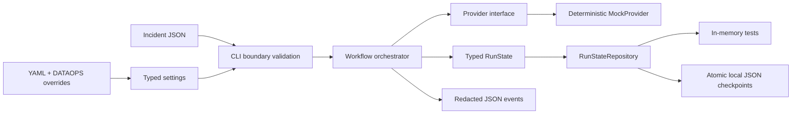

# Architecture

## Design goals

- Provider-neutral LLM layer and typed domain boundaries
- Explicit, append-only workflow evidence
- Deterministic local/mock mode
- Resumable state with auditable, secret-safe events
- Tool isolation, least privilege, and human approval for production mutations

## Phase 1 vertical slice

The CLI validates configuration and incident input before constructing the workflow. Domain
logic depends only on `BaseLLMProvider` and `RunStateRepository`; it imports no vendor SDK or
storage implementation. The default CLI repository writes one JSON file per run under
`out/state/`. Every completed stage appends a typed `StageResult` and saves the full state, so a
run ID can resume without replaying finished stages. Run IDs are restricted before becoming
paths. Atomic replacement has a short bounded retry because synchronized folders such as
OneDrive may transiently lock the destination file.

Structured events contain run, stage, agent, provider/model, latency, token usage, retries,
status, and error-category fields where relevant. Known secret-bearing fields are recursively
redacted. Raw incident payloads are not logged.

## Domain workflow

`observe_and_detect` → `triage_and_classify` → `diagnose_with_specialists` →
`plan_remediation` → `verify_plan_and_simulate` → `risk_score_and_gate` →
`request_human_approval` → `execute_via_controlled_adapter` → `validate_outcome` →
`rollback_if_required` → `record_incident_and_learning`

Phase 1 executes these nodes deterministically but does not yet implement real specialist logic,
external adapters, approval callbacks, or mutations. See ADR-0001 for the overall topology and
ADR-0002 for Phase 1 state/configuration decisions.
